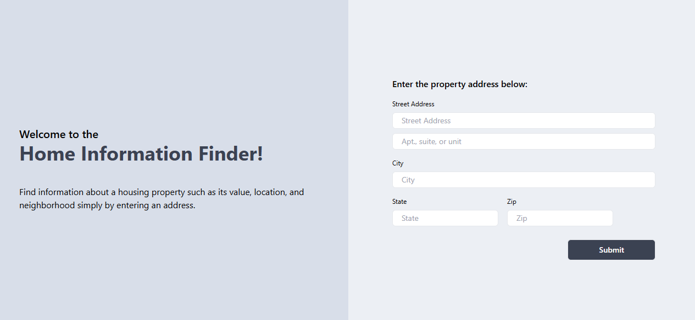

# Home Information Finder



## Overview
Simple program that accepts a home address as input and retrives property information such as an property details, nearby schools, and neighborhood features. Utilizes OpenAI and Google APIs.

### Built With

<table>
<tr><td>

| Tech Stack |
| ----- | 
| [React](https://react.dev/) |
| [Next.js](https://nextjs.org/docs) |
| [Typescript](https://www.typescriptlang.org/docs/) |
| [Tailwind CSS](https://v2.tailwindcss.com/docs) |

</td><td>

| APIs |
| ----- | 
| [Google Address Verification](https://developers.google.com/maps/documentation/address-validation/overview) |
| [Google Places (New)](https://developers.google.com/maps/documentation/places/web-service/op-overview)| 
| [Google Street View Static](https://developers.google.com/maps/documentation/streetview/overview) |
| [Google Maps Javascript](https://developers.google.com/maps/documentation/javascript) |
| [OpenAI GPT-4o-mini](https://platform.openai.com/docs/models) |

</td></tr> </table>

### Assumptions
* All addresses entered are within the United States
* Information provided by ChatGPT-4o-Mini is an accurate estimation of property and location details

## Getting Started

Use git to clone this repository into your local device.
```
git clone https://github.com/vuamy/home-info-finder.git
```

This program uses OpenAI and Google APIs and requires the user to have an API key for both. Navigate to these websites and follow the directions to obtain an API key:

[Google API Key](https://developers.google.com/maps/documentation/javascript/get-api-key)

[OpenAI API Key](https://platform.openai.com/docs/quickstart)

### Prerequisites

Once you have received your API key, create a `.env` file in the root of the project and copy-paste this code snippet, filling out the brackets with your API key.

```
REACT_APP_GOOGLE_API_KEY={INSERT YOUR GOOGLE API KEY}
REACT_APP_OPENAI_API_KEY={INSERT YOUR OPENAI API KEY}
```

### Run Locally

Run this program by navigating to the root directory and typing this command into the terminal:

```
npm run dev
```

Simply enter the home address information on the first page. If the address is validated using Google Address Validator API, the information and location of that home address will be displayed. Otherwise an error will be shown.

## Tests

Some example addresses to test each case provided by ChatGPT.

| Input | Description | Result |
| --- | --- | --- |
| 1600 Pennsylvania Avenue NW, Washington, DC 20500, USA | Valid single-family house | Displays all information |
| 350 5th Ave, New York, NY 10118, USA | Valid apartment building | Not considered a residential address |
| The Dakota Apartments, 1 W 72nd Street, Apt. 75, New York, NY | Valid apartment building including apartment number | Displays all information, some property information may be incorrect |
| 5001 Orchard Park Cir, Davis, CA 95616 | Valid apartment building | Displays information, some property information unknown |
| Wilbur Ave, San Jose, CA 95127 | Missing street number | Invalid address
| 2754 Wilbur Ave | Only street address | Failed to validate address |
| 2754 Wilbur Ave, San Jose | Street address and city | Displays all information |
| 123 Fake Street, Nowhere, CA | Fake address | Invalid address |
| 1234 Wilbur Ave, San Jose, CA 95127 | Fake street number | Failed to validate address |
| 2754 wilbur ave, san jose, ca 95127 | Incorrect capitalization | Displays all information |
| 2754 wilber aev, san jose, ca 95127 | Incorrect spelling | Corrects to right address, displays all information |
| 10 Downing St, London, UK | European address | Invalid address |
| 1 Chome-1-2 Oshiago, Sumida City, Tokyo | Asian address | Invalid address |
| 1701 Airport Blvd Ste B-1130, San Jose, CA 95110 | Non-residential address | Address is not a residential home address

#### Conclusions
* Single-family homes typically display correct information
* Apartment typically containers property value and not rent
* Some apartments labeled as non-residential on Google and therefore do not go through
* Incorrect spelling and capitalization typically still work
* Address validation between fake, non-US, and non-residential works

### Future Work
* Include global home addresses
* Provide more accurate property information via specialized APIs

## Authors

**Amy Vu**, Graduate Student at the University of California, Davis. Entry-level Software Developer.
